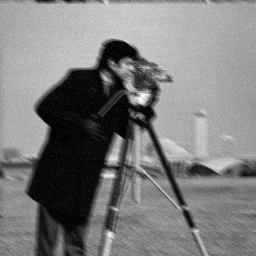
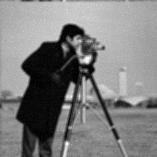
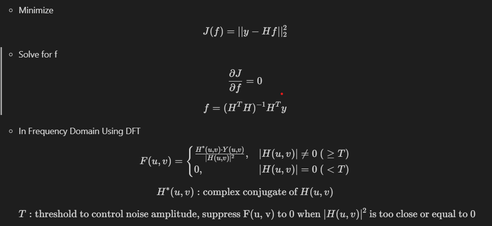
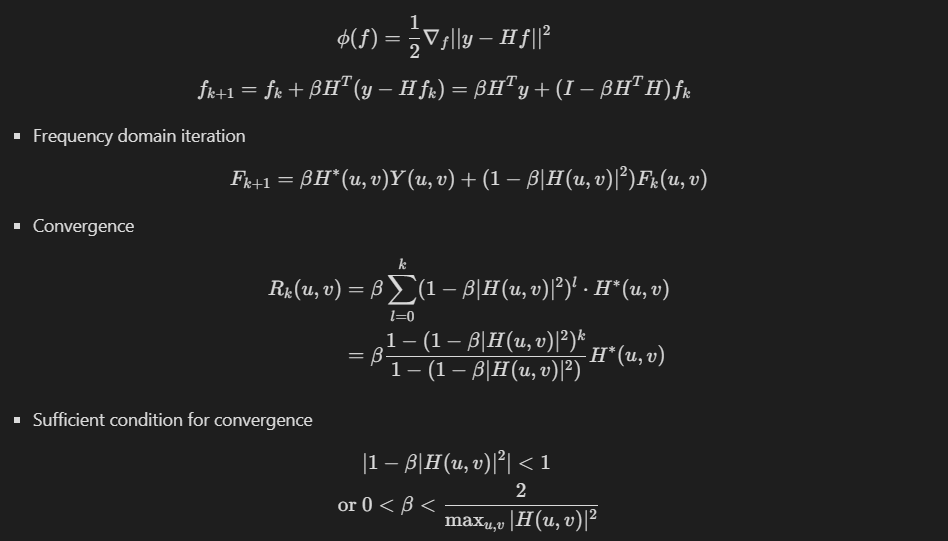
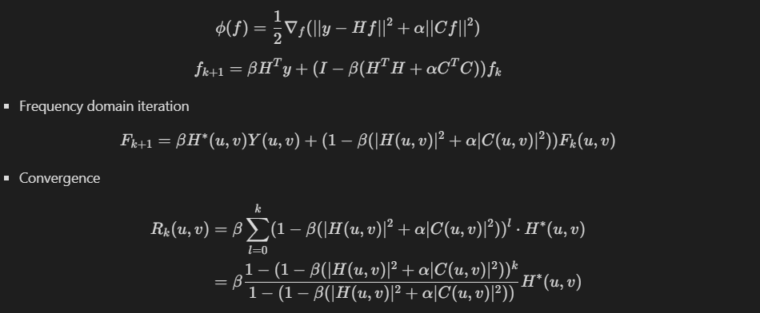
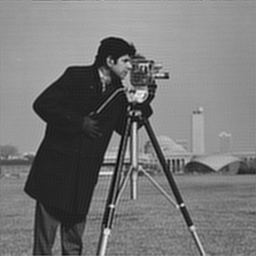
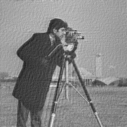

# Image Recovery Techniques Implementation Using OpenCV C++

### Description
Application for experimenting Image Recovery/Restoration techniques including Least Squares, Constrained Least Squares and their iterative approach, Weiner Restoration Filter.

## Prerequisites

- [CMake](https://cmake.org/download/) (version 3.6.0 or higher)
- [OpenCV](https://opencv.org/releases/) (ensure the path is correctly set in `CMakeLists.txt`)
- A C++ compiler (Visual Studio 2022, GCC, Clang, etc.)

## Building the Project

### Clone the Repository

```sh
git clone https://github.com/SebastianKyle/Image-Recovery.git
cd ImageRecovery
```

## Build the project
- One can use the application directly using the pre-built Visual Studio Solution named 'ImageRecovery' in 'out/build/Visual Studio' folder or the executable file in the 'out/build/Visual Studio/Debug' folder.
- Build visual studio solution in build folder (delete the 'out' folder first)
```sh
mkdir build
cd build
cmake ..
```
- Then compile the project based on the C++ compiler used (eg. Build ImageRecovery solution in case of Visual Studio).

## Run application
- After building the project and solution, navigate to out/build/Debug folder (or whatever the folder you built in)
- Run the executable file
```sh
.\ImageRecovery.exe <input-path> <degraded-path> <output-path> <other-args>
```
- It is recommended to place input image in 'images' folder of the repo and set input path to the 'images' or 'results/degraded' folder and output path to 'results/degraded' or 'results/recovered' folder for running command.

## Apply degradation to images
- Gaussian Point Spread Function
```sh
.\ImageRecovery.exe -<input-image-path> -<out-image-path> -degr -gau <psf-size> <sigma> <noise-standard-deviation>
```
Original | Gaussian PSF (size = 5, sigma = 1.2, noise-std = 0.5)
:--------------------------:|:--------------------------:
 | 

- Motion Blur Point Spread Function
```sh
.\ImageRecovery.exe -<input-image-path> -<out-image-path> -degr -motion <psf-size> <angle> <noise-standard-deviation>
```
Original | Motion Blur PSF (size = 7, angle = 30, noise-std = 8)
:--------------------------:|:--------------------------:
 | 

- Defocus Point Spread Function
```sh
.\ImageRecovery.exe -<input-image-path> -<out-image-path> -degr -defocus <psf-size> <radius> <noise-standard-deviation>
```
Original | Defocus PSF (size = 5, radius = 10, noise-std = 8)
:--------------------------:|:--------------------------:
 | 

## Image Recovery 

- Degradation equation
  - $$y = Hf + n$$

- Least Squares
  <!-- - Minimize
    $$J(f) = ||y - Hf||_2^2$$
  - Solve for f
    $$ \frac{\partial J}{\partial f} = 0 $$
    $$ f = (H^T H)^{-1} H^T y $$
  - In Frequency Domain Using DFT
    $$ F(u, v) = \begin{cases} \frac{{H^*(u, v) \cdot Y(u, v)}}{{|H(u, v)|^2}}, & |H(u, v)| \neq 0 \text{ (}\geq T) \\ 0, & |H(u, v)| = 0 \text{ (} < T) \end{cases} $$
    $$H^*(u, v): \text{complex conjugate of } H(u, v)$$
    $$T: \text{threshold to control noise amplitude, suppress F(u, v) to 0 when } |H(u, v)|^2 \text{ is too close or equal to 0} $$  -->
  

- Constrained Least Squares
  - Minimize
      $$J(f) = |y - Hf|_2^2$$
  - Subject to 
      $$||Cf||_2^2 < \epsilon$$
  - Solve for f
      $$\min_{f} \left( |y - Hf|^2 + \alpha |Cf|^2 \right)$$
      $$f = (H^T H + \alpha C^T C)^{-1} H^T y$$
  - Choice for C: a high-pass filter (eg. 2D Laplacian) which imposes a smoothness requirement of the solution for f
  - Frequency domain
      $$F(u, v) = \frac{{H^*(u, v)}}{{|H(u, v)|^2 + \alpha |(C(u, v)|^2)}} Y(u, v)$$
      $$\alpha \downarrow: \text{move closer to Least Squares, more sensitive to noise}$$
      $$\alpha \uparrow: \text{the solution gets smoother}$$
- Iterative restoration:
  - Successive approximation iteration:
    $$f_0 = 0$$
    $$f_{k+1} = f_k + \beta \phi(f)$$
  - Iterative Least Squares:
        <!-- $$\phi(f) = \frac{1}{2} \nabla_f ||y - Hf||^2$$
        $$f_{k+1} = f_k + \beta H^T (y - Hf_k) = \beta H^T y + (I - \beta H^T H)f_k$$ -->
    <!-- - Frequency domain iteration
        $$F_{k+1} = \beta H^*(u, v)Y(u, v) + (1 - \beta |H(u, v)|^2)F_k(u, v)$$
    - Convergence
        $$
        \begin{align*}
        R_k(u, v) &= \beta \sum_{l=0}^{k} (1 - \beta |H(u, v)|^2)^l \cdot H^*(u, v)
        \\ &= \beta \frac{1 - (1 - \beta |H(u, v)|^2)^k}{1 - (1 - \beta |H(u, v)|^2)}H^*(u, v)
        \end{align*}$$
    - Sufficient condition for convergence
        $$
        \begin{align*}
        & |1 - \beta |H(u, v)|^2| < 1
        \\ \text{or } & 0 < \beta < \frac {2}{\max_{u, v} |H(u, v)|^2}
        \end{align*}
        $$ -->
      
  - Iterative Constrained Least Squares
        <!-- $$\phi(f) = \frac{1}{2} \nabla_f (||y - Hf||^2 + \alpha ||Cf||^2)$$ 
        $$f_{k+1} = \beta H^T y + (I - \beta (H^T H + \alpha C^T C))f_k$$ -->
      
      <!-- - Frequency domain iteration
        $$F_{k+1} = \beta H^*(u, v)Y(u, v) + (1 - \beta (|H(u, v)|^2 + \alpha |C(u, v)|^2))F_k(u, v)$$
      - Convergence 
        $$
        \begin{align*}
        R_k(u, v) &= \beta \sum_{l=0}^{k} (1 - \beta (|H(u, v)|^2 + \alpha |C(u, v)|^2))^l \cdot H^*(u, v)
        \\ &= \beta \frac{1 - (1 - \beta (|H(u, v)|^2 + \alpha |C(u, v)|^2))^k}{1 - (1 - \beta (|H(u, v)|^2 + \alpha |C(u, v)|^2))}H^*(u, v)
        \end{align*}$$ -->
      
- Weiner Restoration Filter
  

## Experimental Results
- Least Squares

```sh
.\ImageRecovery.exe -<source-image-path> -<degraded-image-path> -<out-image-path> -recov -ls -<psf-type> <psf-size> <sigma||angle||radius> <threshold-T>
```
Gaussian PSF (size=5,sigma=1.2,noise-std=0.5) | LS Restored (Gau, 5, 1.2, threshold-T=0.001)
:--------------------------:|:--------------------------:
 | 
 | | ISNR = 6.47649

Motion PSF (size=7,angle=30,noise-std=8) | LS Restored (Motion, 7, 30, threshold-T=0.001)
:--------------------------:|:--------------------------:
 | 
 | | ISNR = -0.818203

Defocus PSF (size=5,radius=10,noise-std=8) | LS Restored (Defocus, 5, 10, threshold-T=0.01)
:--------------------------:|:--------------------------:
 | 
 | | ISNR = 0.973734

- Constrained Least Squares
```sh
.\ImageRecovery.exe -<source-image-path> -<degraded-image-path> -<out-image-path> -recov -cls -<psf-type> <psf-size> <sigma||angle||radius> <alpha> <threshold-T>
```

Gaussian PSF (size=5,sigma=1.2,noise-std=0.5) | CLS Restored (Gau, 5, 1.2, alpha=0.01, threshold-T=0.01)
:--------------------------:|:--------------------------:
 | 
 | | ISNR = 5.10674

Motion Blur PSF (size=7,angle,noise-std=8) | CLS Restored (Motion, 7, 30, alpha=0.002, threshold-T=0.02)
:--------------------------:|:--------------------------:
 | 
 | | ISNR = 2.35423

Defocus PSF (size=5,radius=10,noise-std=8) | CLS Restored (Defocus, 5, 10, alpha=0.0015, threshold-T=0.015)
:--------------------------:|:--------------------------:
 | 
 | | ISNR = 2.0127

- Iterative Least Squares

```sh
.\ImageRecovery.exe -<source-image-path> -<degraded-image-path> -<out-image-path> -recov -iterLS -<psf-type> <psf-size> <sigma||angle||radius> <beta> <maxIter>
```

Gaussian PSF (size=5,sigma=1.2,noise-std=0.5) | Iter LS Restored (Gau, 5, 1.2, beta=0.001, maxIter=800)
:--------------------------:|:--------------------------:
 | 
 | | ISNR = 2.46262

Motion Blur PSF (size=7,angle,noise-std=8) | Iter LS Restored (Motion, 7, 30, beta=0.001, maxIter=800)
:--------------------------:|:--------------------------:
 | 
 | | ISNR = -0.960275

Defocus PSF (size=5,radius=10,noise-std=8) | CLS Restored (Defocus, 5, 10, alpha=0.0015, threshold-T=0.015)
:--------------------------:|:--------------------------:
 | 
 | | ISNR = -0.892456

- Iterative Constrained Least Squares

```sh
.\ImageRecovery.exe -<source-image-path> -<degraded-image-path> -<out-image-path> -recov -iterCLS -<psf-type> <psf-size> <sigma||angle||radius> <alpha> <beta> <maxIter>
```

Gaussian PSF (size=5,sigma=1.2,noise-std=0.5) | Iter CLS Restored (Gau, 5, 1.2, alpha=0.05, beta=0.001, maxIter=800)
:--------------------------:|:--------------------------:
 | 
 | | ISNR = 3.49196

Motion Blur PSF (size=7,angle,noise-std=8) | Iter CLS Restored (Motion, 7, 30, alpha=0.05, beta=0.001, maxIter=800)
:--------------------------:|:--------------------------:
 | 
 | | ISNR = 0.440712

Defocus PSF (size=5,radius=10,noise-std=8) | Iter CLS Restored (Defocus, 5, 10, alpha=0.05, beta=0.001, maxIter=800)
:--------------------------:|:--------------------------:
 | 
 | | ISNR = 1.10856

- Weiner Restoration Filter

```sh
.\ImageRecovery.exe -<source-image-path> -<degraded-image-path> -<out-image-path> -recov -weiner -<psf-type> <psf-size> <sigma||angle||radius> <noise-std> <use-source-power-spectrum>
```

Motion Blur PSF (size=7,angle,noise-std=8) | Weiner Restored (Motion, 7, 30, noise-std=8, use-source-power-spectrum=1(true))
:--------------------------:|:--------------------------:
 | 
 | | ISNR = 6.48437

Motion Blur PSF (size=7,angle,noise-std=8) | Weiner Restored (Motion, 7, 30, noise-std=8, use-source-power-spectrum=0(false))
:--------------------------:|:--------------------------:
 | 
 | | ISNR = 4.84438